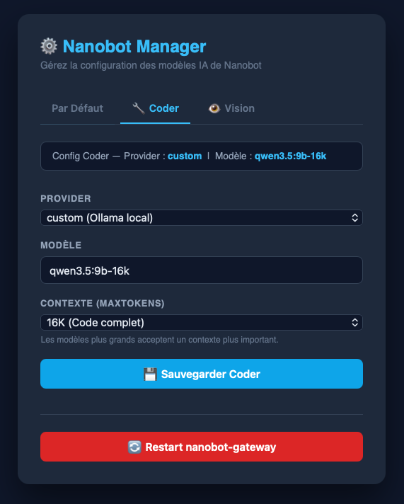
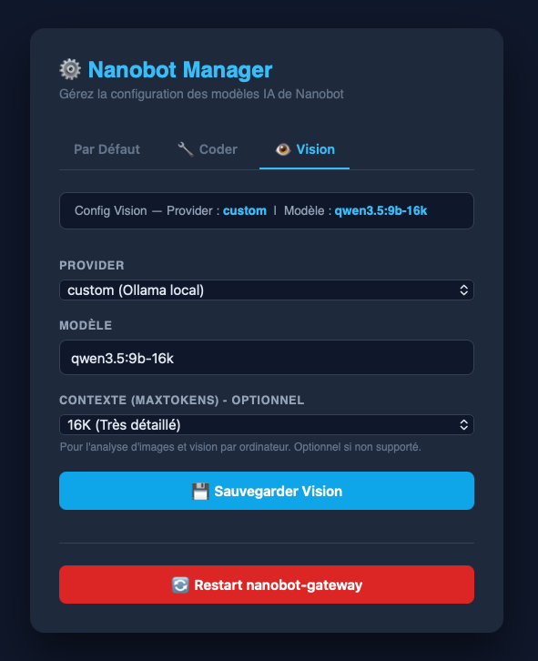

# 🐈 Nanobot Manager

Interface web intuitive pour configurer et gérer les agents IA de [Nanobot](https://github.com/HKUDS/nanobot).

## ✨ Fonctionnalités

### Configuration Multi-Agents

Nanobot Manager permet de configurer **trois types d'agents** de manière indépendante:

- **Par Défaut** - Configuration globale utilisée par tous les agents
- **🔧 Coder** - Optimisé pour la génération et l'analyse de code
- **👁️ Vision** - Optimisé pour l'analyse d'images et la vision par ordinateur

<p align="center">
  
  
  
</p>

### Paramètres Configurables

#### Tous les agents

- **Provider**: Sélection du fournisseur (OpenAI, Anthropic, OpenRouter, custom Ollama)
- **Modèle**: Choisir parmi les modèles Ollama disponibles ou saisir manuellement

#### Agent Coder & Vision

- **Contexte (maxTokens)**: Taille maximale du contexte avec **8 valeurs prédéfinies**
  - 2K, 4K, 8K, 16K (par défaut), 32K, 64K, 128K
  - Support des valeurs personnalisées
- Vision: maxTokens est optionnel (conforme à la spec Nanobot)

### Autres Fonctionnalités

- 📡 Lecture des modèles disponibles sur Ollama en temps réel
- 🔄 Redémarrage de nanobot-gateway directement depuis l'interface
  - **Mode Docker**: Via l'API Docker Socket Proxy
  - **Mode Host**: Via SSH + systemctl sur la machine hôte
- ⚙️ Configuration flexible du mode d'exécution (Docker ou Host)
- 💾 Sauvegarde automatique dans `config.json`
- 🎨 Interface dark mode responsive et moderne
- ✅ Validation complète côté serveur

## 🚀 Quick Start

### Prérequis

- Docker & Docker Compose
- Nanobot configuré et en cours d'exécution
- Accès au fichier de configuration Nanobot

### Démarrage

0 **Créer le réseau Docker** (si pas déjà fait et si activé dans le compose.yaml)

```bash
docker network create socket-proxy-nbt-mngr-network
```

1 **Construire l'image**

```bash
docker compose build --no-cache
```

2 **Lancer le container**

```bash
docker compose up -d
```

3 **Accéder à l'interface**

```
http://localhost:8899
```

### Configuration via Variables d'Environnement

```bash
# Chemin du fichier config.json de Nanobot
CONFIG_PATH=/opt/stacks/nanobot/config/config.json

# URL de l'instance Ollama
OLLAMA_URL=http://ollama:11434

# URL du proxy Docker Socket (mode Docker)
DOCKER_PROXY_URL=http://docker-socket-proxy:2375

# Variables pour mode Host (exécution via systemctl sur l'hôte)
HOST_SSH_USER=your_username          # Utilisateur sur l'hôte
HOST_SSH_HOST=localhost              # Adresse de l'hôte
HOST_SSH_PORT=22                     # Port SSH (défaut: 22)
```

### Configuration du Mode Host (SSH)

Si vous voulez utiliser Nanobot Manager pour redémarrer nanobot-gateway via `systemctl` sur la machine hôte:

1. **Générer une clé SSH dans le container**
   ```bash
   docker exec nanobot-manager ssh-keygen -t ed25519 -f /root/.ssh/id_ed25519 -N ""
   docker exec nanobot-manager cat /root/.ssh/id_ed25519.pub
   ```

2. **Ajouter la clé publique sur l'hôte**
   ```bash
   # Sur la machine hôte, ajouter la clé au authorized_keys
   echo "ssh-ed25519 AAAA..." >> ~/.ssh/authorized_keys
   chmod 600 ~/.ssh/authorized_keys
   ```

3. **Configurer les variables d'environnement dans compose.yaml**
   ```yaml
   environment:
     - HOST_SSH_USER=your_username
     - HOST_SSH_HOST=localhost
     - HOST_SSH_PORT=22
   ```

4. **Ajouter les volumes SSH dans compose.yaml**
   ```yaml
   volumes:
     - ~/.nanobot:/root/.nanobot
     - ~/.ssh/nanobot-manager:/root/.ssh:ro
   ```

5. **Sélectionner le mode "Machine hôte" dans l'onglet ⚙️ Paramètres**

## 📋 Configuration Complète

### Structure du Projet

```
nanobot-manager/
├── app.py                    # Application Flask (routes API)
├── requirements.txt          # Dépendances Python
├── Dockerfile               # Image Docker
├── templates/
│   └── index.html          # Interface web
└── .gitignore

compose.yaml                 # Configuration Docker Compose
README.md                    # Ce fichier
FEATURES.md                  # Documentation détaillée des fonctionnalités
TESTING_GUIDE.md            # Guide de test
AGENTS.md                    # Conventions de code pour les agents
```

### Fichier config.json (Structure)

Après configuration via Nanobot Manager, votre `config.json` ressemblera à:

```json
{
  "agents": {
    "defaults": {
      "model": "gpt-4-turbo",
      "provider": "openai"
    },
    "coder": {
      "model": "gpt-4-turbo",
      "provider": "openai",
      "maxTokens": 32768
    },
    "vision": {
      "model": "gpt-4-vision",
      "provider": "openai",
      "maxTokens": 16384
    }
  },
  "channels": { ... },
  "providers": { ... },
  "tools": { ... }
}
```

## 🎯 Cas d'Usage

### Scenario 1: Développement Local avec Ollama

```json
{
  "agents": {
    "defaults": {
      "model": "qwen3.5:9b-16k",
      "provider": "custom"
    },
    "coder": {
      "model": "qwen3.5:9b-16k",
      "provider": "custom",
      "maxTokens": 16384
    },
    "vision": {
      "model": "llava",
      "provider": "custom"
    }
  }
}
```

### Scenario 2: Production avec OpenAI

```json
{
  "agents": {
    "defaults": {
      "model": "gpt-4-turbo",
      "provider": "openai"
    },
    "coder": {
      "model": "gpt-4-turbo",
      "provider": "openai",
      "maxTokens": 32768
    },
    "vision": {
      "model": "gpt-4-vision",
      "provider": "openai",
      "maxTokens": 16384
    }
  }
}
```

### Scenario 3: Hybride (Meilleur des deux mondes)

```json
{
  "agents": {
    "defaults": {
      "model": "qwen3.5:9b-16k",
      "provider": "custom"
    },
    "coder": {
      "model": "gpt-4-turbo",
      "provider": "openai",
      "maxTokens": 32768
    },
    "vision": {
      "model": "gpt-4-vision",
      "provider": "openai",
      "maxTokens": 16384
    }
  }
}
```

## 🔌 API Endpoints

### Configuration par Défaut

- `GET /api/config` - Récupérer la configuration actuelle
- `GET /api/models` - Récupérer les modèles Ollama disponibles
- `POST /api/update` - Mettre à jour le modèle/provider par défaut

### Configuration Coder

- `GET /api/coder` - Récupérer la configuration Coder
- `POST /api/coder/update` - Mettre à jour la configuration Coder

### Configuration Vision

- `GET /api/vision` - Récupérer la configuration Vision
- `POST /api/vision/update` - Mettre à jour la configuration Vision

### Système

- `GET /` - Interface web
- `GET /api/execution-type` - Récupérer le mode d'exécution (docker ou host)
- `POST /api/execution-type/update` - Configurer le mode d'exécution
- `POST /api/restart` - Redémarrer nanobot-gateway (mode adapté: Docker ou systemctl/SSH)

## 🧪 Tester Localement

### Sans Docker

```bash
# Installer les dépendances
pip install -r nanobot-manager/requirements.txt

# Lancer l'application
cd nanobot-manager
python3 app.py
```

L'application sera accessible à `http://localhost:8899`

### Avec Docker

```bash
# Construire
docker compose build

# Lancer
docker compose up -d

# Voir les logs
docker compose logs -f nanobot-manager

# Arrêter
docker compose down
```

## 📚 Documentation

- **[FEATURES.md](FEATURES.md)** - Description complète de toutes les fonctionnalités
- **[TESTING_GUIDE.md](TESTING_GUIDE.md)** - Guide de test avec checklists
- **[AGENTS.md](AGENTS.md)** - Conventions de code pour les agents développeurs

## 🔐 Sécurité

- ✅ Validation côté serveur de tous les champs
- ✅ Pas de gestion des API keys (utiliser le config.json directement)
- ✅ Aucune donnée sensible stockée en navigateur
- ✅ Messages d'erreur informatifs
- ✅ Support de Docker Socket Proxy pour l'accès sécurisé

## 🐛 Dépannage

### Configuration ne s'applique pas

1. Vérifier la sauvegarde dans l'onglet approprié
2. Cliquer sur "🔄 Redémarrer Nanobot"
3. Attendre le redémarrage
4. Vérifier les logs: `docker compose logs nanobot-manager`

### Les modèles Ollama n'apparaissent pas

- Vérifier que Ollama est en cours d'exécution
- Vérifier l'URL Ollama: `curl $OLLAMA_URL/api/tags`
- Les modèles doivent être téléchargés: `ollama pull llama2`

### Mode Host: Erreur "SSH error" ou "Host not reachable"

- Vérifier que la clé SSH est générée: `docker exec nanobot-manager ls -la /root/.ssh/`
- Vérifier que la clé publique est dans `~/.ssh/authorized_keys` sur l'hôte
- Tester la connexion SSH depuis le container:
  ```bash
  docker exec nanobot-manager ssh -o StrictHostKeyChecking=no user@localhost "systemctl --user status nanobot-gateway"
  ```
- Vérifier les permissions: `chmod 600 ~/.ssh/authorized_keys`

### Erreurs de permission

- Vérifier l'accès au fichier config.json
- Vérifier les permissions Docker: `docker ps` (mode Docker)
- Vérifier le socket proxy: `curl $DOCKER_PROXY_URL/version` (mode Docker)
- Vérifier les logs SSH: `docker exec nanobot-manager ssh -v ...` (mode Host)

### Port 8899 déjà en utilisation

```bash
# Trouver le processus
lsof -i :8899

# Ou modifier dans compose.yaml:
# ports:
#   - "8900:8899"  # Nouveau port
```

## 🔄 Workflow Typique

1. **Configuration initiale**
   - Aller à l'onglet "⚙️ Paramètres"
   - Sélectionner le mode d'exécution (Docker ou Machine hôte)
   - Sauvegarder les paramètres
   
2. **Accéder** à <http://localhost:8899>
3. **Configurer** l'agent Par Défaut
   - Sélectionner le provider (openai, custom, etc.)
   - Choisir le modèle
   - Sauvegarder
4. **Configurer** l'agent Coder
   - Aller à l'onglet "🔧 Coder"
   - Saisir modèle/provider/tokens
   - Sauvegarder
5. **Configurer** l'agent Vision
   - Aller à l'onglet "👁️ Vision"
   - Saisir modèle/provider/tokens (optionnel)
   - Sauvegarder
6. **Redémarrer** Nanobot
   - Cliquer "🔄 Redémarrer Nanobot"
   - Attendre le redémarrage (le mode utilisé dépend de la configuration ⚙️)
7. **Vérifier** la configuration
   - Les badges affichent la configuration actuelle
   - Les changements sont persistés dans config.json

## 📈 Performance & Limitations

- ✅ Interface responsive sur tous les appareils
- ✅ Chargement < 2s pour chaque onglet
- ✅ Support de contextes jusqu'à 128K tokens
- ✅ Validation automatique de tous les champs
- ⚠️ Nécessite Docker pour le redémarrage du container
- ⚠️ Ollama doit être accessible pour charger les modèles

## 🤝 Contribution

Les contributions sont bienvenues! Consultez [AGENTS.md](AGENTS.md) pour les conventions de code.

### Développement

```bash
git clone https://github.com/IMNotMax/nanobot-manager.git
cd nanobot-manager
pip install -r nanobot-manager/requirements.txt
cd nanobot-manager
python3 app.py  # Démarrer le serveur
```

## 📄 Licence

Ce projet est fourni tel quel pour la gestion de Nanobot.

## 🙋 Support

- 📖 Consultez la [documentation Nanobot officielle](https://github.com/HKUDS/nanobot)
- 🐛 Signalez les bugs dans les issues GitHub
- 💬 Questions? Consultez [FEATURES.md](FEATURES.md) ou [TESTING_GUIDE.md](TESTING_GUIDE.md)

## 🗺️ Roadmap

- [ ] Mode clair/sombre amélioré
- [x] Port configurable
- [ ] Export/import de configurations
- [ ] Historique des modification
- [ ] Support multilingue

---

**Dernière mise à jour**: 2026-03-04  
**Version**: 0.2 (Avec support Coder & Vision)  
**Support Nanobot**: v0.1.4+
